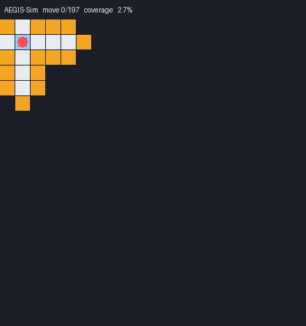

# AEGIS

**Autonomous Emergency Ground Intelligence System**

[](https://github.com/garvitforge/aegis/actions/workflows/tests.yml)


AEGIS is a simulation-first robotics project. A robot explores an **unknown** grid world using only what its sensors have revealed, builds a map as it goes, plans with A* and BFS, decides where to explore next, and returns to base before its battery runs out.



*Orange = frontier (unknown cells next to known free space), blue = the robot's trail, green box = base. The robot never sees the true map, only what its range sensor has revealed.*

The long-term goal is an autonomous exploration and emergency-response platform. This repository builds the algorithmic foundations in simulation first, then moves to hardware.

> **Honest scope:** everything under "Implemented" exists in this repo and is covered by tests. Everything under "Planned" does not exist yet.

## Results

On 100 seeded 20x20 maps per family (full method and caveats in [`docs/EXPERIMENTS.md`](docs/EXPERIMENTS.md)):

| Strategy | Moves to 90% coverage | Moves to full coverage |
|---|---|---|
| random walk | rarely gets there | never (800-move budget) |
| nearest frontier | 168.7 | **221.2** |
| AEGIS scored frontier | **139.6** | 241.2 |

*Random-obstacle maps, density 0.2. Room-style maps show the same pattern.*


Two findings:

- **Scored exploration reaches 90% coverage about 17% sooner**, but **finishes about 9% later** than nearest-first. Greedy information gain leaves scattered leftovers for the end. Neither is strictly better, and a hybrid is the next experiment.
- **Planning is ~37x faster** after replacing one A* search per frontier candidate with a single BFS distance map, with identical decisions on all 1,265 tested states (checked by a differential test against the original implementation).

## The core idea: the planner never sees the real map

The simulator holds a hidden ground-truth map. The robot learns about it only through a range sensor, stores that in a partial occupancy map, and plans **only over cells it has already discovered to be free**. Entering unknown space raises an error.

```
sense -> update map -> find frontiers -> score them -> path to the best one -> move -> sense ...
```

## Quickstart

```bash
git clone https://github.com/garvitforge/aegis.git
cd aegis
pip install -e ".[dev]"

pytest                                   # run the test suite
aegis                                    # A* path-planning demo
python -m aegis.mission_demo             # full mission with a metrics report
aegis benchmark --maps 50 --seed 0       # compare exploration strategies
aegis replay --kind rooms --seed 3 --out replay.gif   # animated GIF (needs Pillow)
aegis replay --ascii                     # final map as text, no Pillow needed
```

The core library has no runtime dependencies. Pillow is only needed for GIF/PNG output (`pip install -e ".[viz]"`).

## Current status

**v0.6: measured exploration strategies (simulation)**

Implemented:

- Grid-world environment and obstacle representation
- 4-connected A* path planning
- Robot state and battery model
- Deterministic range-sensor simulation
- Partial-observability occupancy map
- Unknown-space frontier detection
- Closed-loop sense -> map -> plan -> move -> sense exploration
- Planning restricted to discovered free space
- Frontier scoring: `score = 2 * information_gain - path_distance`, where information gain is the number of still-unknown cells adjacent to the frontier cell; deterministic tie-breaking
- Battery-aware return-to-base mission mode
- Mission decision telemetry and safety-stop tracking
- BFS distance-map planner with a reference implementation and differential tests
- Seeded map generators (random obstacles, rooms joined by doors)
- Strategy comparison framework: random walk vs. nearest vs. scored frontier
- Animated GIF replay and coverage charts (optional, needs Pillow)
- Unit tests and CI on Python 3.10, 3.11 and 3.12

## Known limitations

- The grid is 4-connected and the sensor reads four directions only.
- "Information gain" is a simple local heuristic, not an entropy-based measure.
- No noise model yet: sensors are perfect and motion is exact.
- Results come from 20x20 maps, one sensor range and two map families.
- The battery policy switches to return mode at a fixed reserve level; it does not yet check that the remaining charge covers the trip home.

## Roadmap

Next (simulation):

- [x] Seeded random map generator and more benchmark scenarios
- [x] Baseline comparison: random walk vs. nearest vs. scored frontier
- [x] Faster planning via one BFS distance map per decision
- [x] Animated replay of a mission (GIF)
- [ ] Hybrid frontier strategy (information gain early, nearest-first late)
- [ ] Return-to-base that accounts for distance home, not a fixed reserve
- [ ] Dynamic obstacles
- [ ] Sensor noise model

Later:

- [ ] Live telemetry dashboard
- [ ] Hardware abstraction layer (sensor and motor interfaces)
- [ ] Computer vision
- [ ] Physical robot integration

## Architecture

```
Sensors / Simulator
        |
   Perception            (range sensing only, so far)
        |
Environment Model        (occupancy map: implemented)
        |
 Decision / Planner      (frontier scoring + BFS/A*: implemented)
        |
 Motion Controller       (simple path following)
        |
 Robot / Simulator
        |
Telemetry & Logging      (mission metrics: implemented)
```

Sensor fusion and real perception are planned but not yet implemented. See [`docs/ARCHITECTURE.md`](docs/ARCHITECTURE.md), [`docs/EXPLORATION.md`](docs/EXPLORATION.md), [`docs/SENSING_MAPPING.md`](docs/SENSING_MAPPING.md) and [`docs/EXPERIMENTS.md`](docs/EXPERIMENTS.md).

## Project layout

| Path | Purpose |
|---|---|
| `aegis/grid.py`, `mapping.py`, `sensors.py`, `state.py` | world, partial map, range sensor, robot state |
| `aegis/planning.py`, `distance.py` | A* and BFS distance maps |
| `aegis/exploration.py`, `decision.py`, `mission.py` | frontiers, scoring, mission loop with return-to-base |
| `aegis/generators.py`, `experiment.py`, `trace.py` | seeded maps, strategy comparison, coverage reconstruction |
| `aegis/render.py`, `viz.py` | ASCII output; GIF and chart output |
| `tests/` | unit tests, differential tests, reproducibility tests |

## Engineering principles

- Reproducible experiments (deterministic simulation, seeded generators)
- Small testable components
- Measurable performance
- A slow reference implementation kept as a correctness oracle for the fast one
- Hardware/software separation
- Fail-safe behavior
- Documented assumptions

## Project status

This is an actively developed student engineering project. Features are marked as implemented only after they exist in the repository and are tested.
