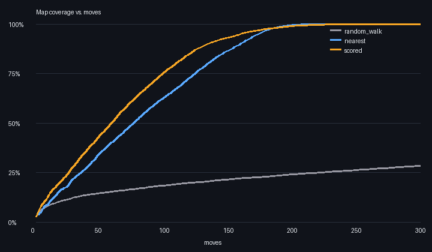

# Experiments

This document records measurable experiments rather than subjective claims.
Every number below is produced by code in this repository and can be regenerated with the commands shown.

## Reproducibility

Every benchmark should record:
- Map dimensions
- Obstacle layout or random seed
- Start and goal
- Algorithm
- Python version
- Hardware, when relevant

All maps come from seeded generators (`aegis/generators.py`), and the simulation has no randomness other than the seeded random-walk baseline, so results are identical across runs. **Timing numbers depend on the machine**; move counts and coverage do not.

## Experiment 1: A* on deterministic grid maps

Status: implemented and unit-tested.

## Experiment 2: replacing per-candidate A* with one BFS distance map

**Question.** Every decision scores every frontier candidate by its path length. The original implementation ran a separate A* search per candidate (and rebuilt the set of unknown cells each time). Can one breadth-first search from the robot replace all of them without changing any decision?

**Method.** 1,265 real decision states were collected from missions on ten seeded 20x20 random maps (density 0.2, sensor range 3). For each state, both implementations computed the full candidate list.

- Reference: `frontier_candidates_reference` (one A* per candidate)
- New: `frontier_candidates` (one BFS via `aegis/distance.py`)

**Result.**

| Implementation | Mean time per decision |
|---|---|
| A* per candidate (reference) | 15.2 ms |
| One BFS distance map | 0.41 ms |

About **37x faster**, with **identical output on all 1,265 states**. The same equivalence is enforced by `tests/test_decision_equivalence.py`, so the fast version cannot silently drift from the reference.

Environment: Python 3.12.3 in a Linux container. Absolute times will differ on other machines; the ratio is what matters.

**Why it works.** All candidates share the same start, and every edge costs 1, so a single BFS gives the exact shortest distance to every known free cell. A* is only worth it for a single start/goal pair.

## Experiment 3: exploration strategies

**Question.** Does choosing frontiers by `2 * information_gain - distance` explore faster than simpler strategies?

**Strategies** (identical maps, identical sensor):

- `random_walk`: move to a random known-free neighbour
- `nearest`: go to the closest frontier, ignoring information gain
- `scored`: AEGIS scoring

**Setup.** 100 maps per kind, 20x20, sensor range 3, base seed 0, budget 800 moves. "Coverage" is the fraction of reachable free cells discovered. Battery reserve is disabled so battery policy does not affect the comparison.

```
aegis benchmark --maps 100 --size 20 --density 0.2 --sensor-range 3 --seed 0 --kind random --chart docs/coverage_random.png
aegis benchmark --maps 100 --size 20 --sensor-range 3 --seed 0 --kind rooms  --chart docs/coverage_rooms.png
```

### Random obstacles (density 0.2)

| strategy | completed | moves to finish (mean) | moves to 90% (mean, share that got there) | coverage @50 | @100 | @200 |
|---|---|---|---|---|---|---|
| random_walk | 0% | n/a | 697.0 (2% reached) | 11.2% | 17.2% | 27.6% |
| nearest | 100% | 221.2 | 168.7 (100%) | 31.8% | 58.4% | 98.0% |
| scored | 100% | 241.2 | 139.6 (100%) | 42.3% | 74.8% | 97.4% |


### Rooms joined by doors

| strategy | completed | moves to finish (mean) | moves to 90% (mean, share that got there) | coverage @50 | @100 | @200 |
|---|---|---|---|---|---|---|
| random_walk | 0% | n/a | n/a (0% reached) | 14.5% | 18.4% | 24.1% |
| nearest | 100% | 201.4 | 161.4 (100%) | 34.7% | 62.9% | 99.4% |
| scored | 100% | 224.4 | 136.5 (100%) | 43.6% | 75.5% | 98.9% |



### What the data says

1. Both frontier strategies are far better than random walking, as expected.
2. **Scored exploration is faster early**: about 17% fewer moves to reach 90% coverage on random maps (139.6 vs 168.7) and about 15% fewer on room maps (136.5 vs 161.4).
3. **But scored finishes later**: it needs about 9% more moves to reach full coverage on random maps (241.2 vs 221.2) and about 11% more on room maps. The greedy information-gain term pulls the robot toward rich frontiers and leaves scattered leftover cells to be collected at the end, which costs extra travel.
4. So neither strategy is strictly better. Which one wins depends on whether you care about early coverage (finding survivors quickly) or finishing the whole map.

### Limitations

- Idealized, noise-free sensor and motion.
- Only 20x20 maps, one sensor range, two map families.
- One run per map per strategy (the simulation is deterministic apart from the seeded random walk).
- The random-walk baseline is deliberately weak; it shows that planning matters, not that the planner is optimal.

### Next experiment

Test a hybrid that scores by information gain while many frontiers remain and switches to nearest-first near the end, then check whether it keeps the early lead without the late penalty.
